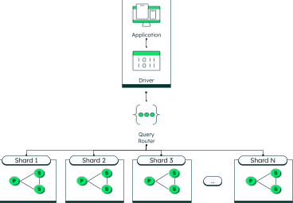

## Участники

Т.М. Татарникова, Е.Д. Архипцев
Санкт-Петербургский государственный электротехнический университет
"ЛЭТИ" им. В.И. Ульянова(Ленина)

tm-tatarn@yandex.ru

## Аннотация

В современном мире информационные системы связанны с обменом сообщениями
занимают лидирующие позиции среди всех систем. Самые популярные из них
обрабатывают сотни миллионов сообщений ежедневно. Это вызывает большую
нагрузку на базы данных. Именно по этому выбор конкретной базы данных
так важно. В данной работе будет рассмотрены СУБД MongoDB и CasandraDB,
а также причины перехода на CasandraDB для большой распределённой
информационной системе.

## Ключевые слова

СУБД, MongoDB, сегментация данных, масштабируемость, CasandraDB, ключ 
кластеризации.

# Методы оптимизации больших информационных систем.

В данной работе будет рассмотрены причины перехода и сам переход с 
СУБД MongoDB на CasandraDB. Также будут рассмотрены требования к СУБД
для большой информационной системе на примере системы обмена 
сообщениями. 

Для ИС сперва была выбрана БД MongoDB, поскольку она являет лидирующей
СУБД для быстрого выполнения итерация. Гибкая система хранения информации,
масштабируемость, сегментирование и репликация позволяют удобно работать
с данными и обслуживать большие ИС. 

Однако большое число сообщений и данных создают следующую проблему:
данные и индексы больше не помещаются в оперативную память, 
соответственно задержки становятся непредсказуемыми. Это происходит
из-за того, что MongoDB хранит индексы в ОЗУ. В том случае, если в ОЗУ
больше нет места, СУБД будет читать индексы с диска, что повышает
время выполнения запроса.

Рассмотрим, как выглядит сегментация данных в MongoDB. Сперва выделим
основные составляющие сегментного кластера:

- **Сегмент**. Сегментный кластер распределяет данные по сегментам. 
Сегмент хранит некую часть всего множества данных.
- **Маршрутизатор mongos**. Диспетчер, которые служит для связывания
всех сегментов к единому целому. Используется для перенаправления 
операций чтения и записи на подходящий сегмент. Важно отметить, что
данные элемент системы не хранит данные.
- **Конфигурационный сервер**. Поскольку mongos не сохраняет данные, 
этим занимаются конфигурационные сервера, которые отвечают за
хранение метаданных кластера, местоположение каждой базы данных, 
информацию об изменениях и т.д.

Рис. 1 - Кластер MongoDB

Для больших объёмов данных необходимо оптимизация СУБД. Именно в такой
ситуации прибегают к сегментации коллекции и
распределения операций чтения и записи. Каждый документ в MongoDB 
прикрепляется к диапазону посредства сегментного ключа. Сегментный
ключ состоит из комбинации одного или нескольких полей. 

MongoDB использует ключи сегментирования, чтобы определить, куда может
попасть значение данных. Администраторы баз данных могут определить
ключи сегментирования для распределения данных на разделы.
Данные можно разделить на основе таких факторов, как географическое
положение, алфавитный порядок или любая другая система, наиболее
эффективная для вашего набора данных.

Однако Для больших коллекций наступает проблема: объём данных превысил
объем ОЗУ. Постепенное добавление серверов в конечном счёте приведёт к
замедлению производительности, а задержки станут непредсказуемыми.

Опишем проблемы хранения данных в большой информационной системе 
предназначенной для обмена сообщениями:
- Невозможность определения частоты выполнения чтения и записи. Иными
словами нельзя сказать, какая операция будет выполняться чаще или реже.
- В случае групп или сообществ делающих акцент на голосовых/видео
коммуникациях, количество сообщений может не превышать 1000 за год. 
Таким образом выгрузка последних 50 сообщений повлечет к множеству 
случайных запросов на диске, вызывающих чтение данных не с ОЗУ.
- Диалоги с большим количеством участников и сообщений затрагивает
в основном именно последние сообщений. Они кешируются и находятся в
кэше диска.

Исходя из проблематики можно выделить требования к новой СУБД:
- **Линейная масштабируемость**. Отсутствие придела при котором
добавление нового сервера к кластеру не принесёт результатов.
- **Низкие затраты на обслуживание**. Простота в настройке и добавлении
новых узлов.
- **Предсказуемая производительность**. Время запросов(всех или почти
всех)не должно превышать установленный предел. Отсутствие надобности
кеширования запросов на промежуточном ПО также поможет упросить систему.
- **Открытый исходный код**. 
 
Исходя из требований описанных выше можно выделить CasandraDB. Данная
СУБД позволяет быстро и легко добавлять узлы для масштабирования. Также
она может терпеть потерю узлов без какого ли влияния на приложение.

Сделав такой выбор, необходимо доказать, что это действительно работает.

CasandraDB можно описать как KKV хранилище(Отличает от привычного 
нам Key/Value хранилища). Первичный ключ K всегда состоит из двух 
ключей: первый является ключ раздела, который показывает к какому узлу
относятся данные и где они находятся на диске. Сам раздел включает в 
себя множество строк и эта строка идентифицируется вторым ключом K и 
является ключом кластеризации. Ключ кластеризации действует как 
первичный ключ внутри раздела, а также может использоваться в качестве
элемента для сортировки строк. Например, в случае сообщений в качестве
первого ключа можно выбрать идентификатор чата(chat_id), а в качестве 
второго ключа идентификатор сообщения (message_id). Хотя схема 
Casandra очень напоминает реляционную базу данных, их дешево изменять 
и они не оказывают какого-либо влияния на производительность.

Какую проблему можно выделить, когда у нас появляются разделы 
большого объёма: большая нагрузка на CasandraDB при сжатии раздела,
невозможность кластеризации большого раздела.

Для решения данной проблемы добавим новую прослойку под названием
корзина(bucket_id) в которую будем помещать сообщения за N период
времени. В зависимости от величины проекта, величину N необходимо
подобрать самостоятельно. На текущий момент оно не должно превышать
2 гигабайта.

Теперь для получения последних сообщения в чате мы запрашиваем 
сообщения от текущего времени до времени создания чата (это ещё одна
возможность оптимизации, которая позволяет вовремя остановиться и не 
перебирать все разделы). Затем вы выбираем последовательно все разделы,
пока не будет получено нужно число сообщений или выборка будет 
завершена. Из данного утверждения можно сделать вывод, что текущее
решение будет оптимально для крупных чатов с большим количество
сообщений, поскольку их сообщения будут лежать в последних(или первом)
разделе. Однако для сообществ, где сообщения редки - данный способ наоборот
будет не эффективный, поскольку придется затратить большее время на
перебор.

Проведем сравнение этих двух СУБД.

### Модель данных

Cassandra использует модель данных с широкими столбцами, более
близкую к реляционным базам данных.

MongoDB полностью отходит от реляционной модели, храня данные в виде
документов.

### Доступность

Cassandra имеет несколько главных узлов, распределение узлов на 
разделы и репликацию ключей для обеспечения высокой доступности.

MongoDB использует один первичный узел и несколько узлов-реплик. В
сочетании с сегментированием MongoDB обеспечивает высокую доступность
и масштабируемость.

### Поддержка разделов

Согласованный алгоритм хэширования, меньший контроль со стороны
пользователей.

Пользователи определяют ключи сегментирования и имеют больший контроль
над разбивкой на разделы.

## Вывод

Высокое время безотказной работы и распределенная архитектура
Cassandra делают этот сервис хорошим выбором для поддержания 
требований к высокой доступности. Благодаря способности MongoDB
обрабатывать неструктурированные данные с помощью 
документоориентированного подхода этот сервис полезен для систем, где
данные постоянно меняются. Именно по этому для разработки системы
обмена сообщениями, более эффективно выбрать CasandraDB, чем MongoDB.
Именно из-за того, что для нас скорость обработки запросов первостепенна,
а структура сообщений мало изменяема.

*****ЛИТЕРАТУРА*****

