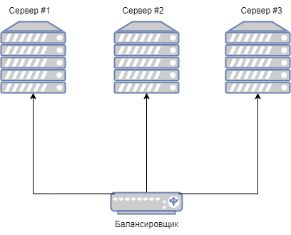
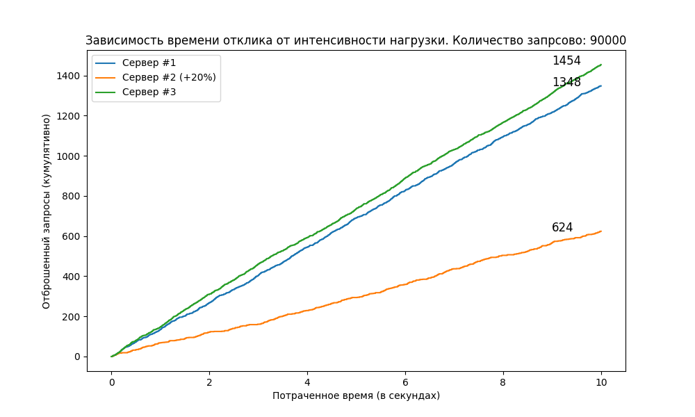
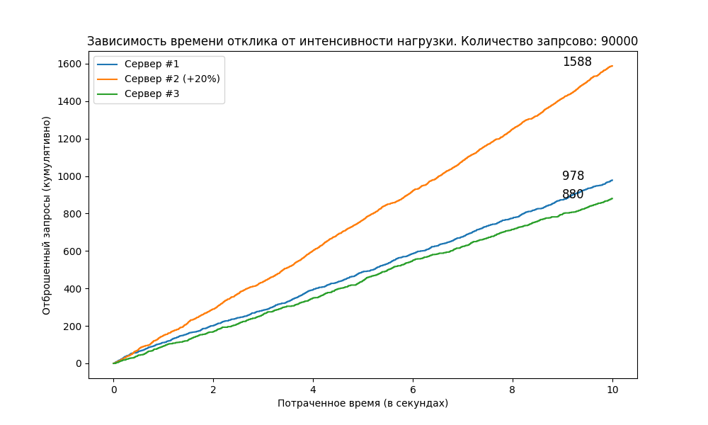
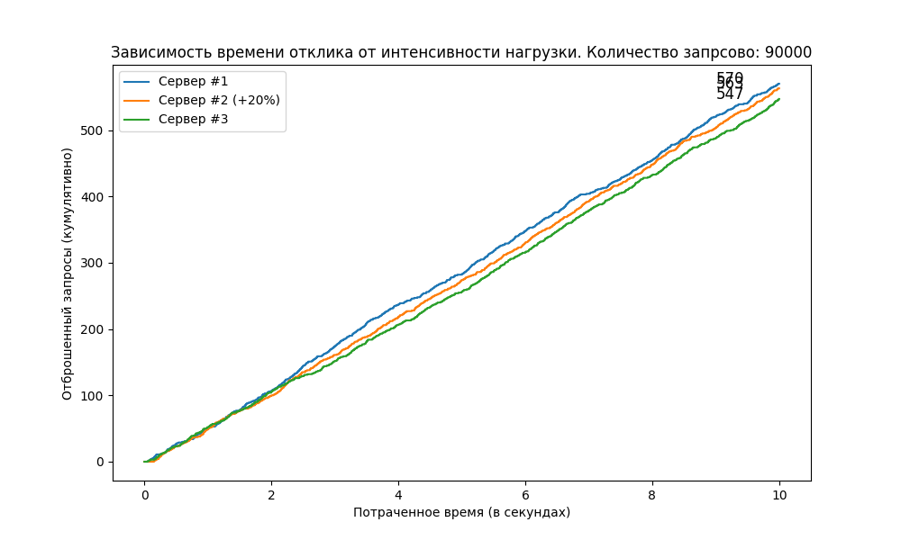

## Задание на практику

1. Изучение балансировщиков нагрузки систем массового обслуживания.
2. Сравнение балансировки различными способами.


### Описание алгоритмов балансировки

Алгоритм балансировки нагрузки – это набор правил, которым следует балансировщик нагрузки для определения наилучшего
сервера для каждого из различных клиентских запросов. 

### Статическая балансировка нагрузки

Данный тип алгоритмов следует фиксированным правилам и никак не зависит от состояния очереди, нагрузки и текущего 
состояния серверов. Балансировщик может лишь определить требуемые ресурсы и узел, на который должна отправить задача,
без сопутствующего анализа. Данный способ минимизирует нагрузку на процессор балансировщика нагрузки. 

#### Round Robin (алгоритм циклического перебора)

Цель алгоритма: равномерное распределение задач по всем узлам. Все задания распределяются по порядку в цикле, что
означает, что по достижении последней доступной цели, балансировщик нагрузки
переключится обратно к первой цели. Выбор целей осуществляется локально, без взаимодействия с другими балансировщиками
нагрузки. Этот же фактор является основным преимуществом данного алгоритма. В Общих случаях алгоритм не обеспечивает
высокой производительности.

В идеальных условиях данный способ балансировки будет справляться с любой нагрузкой быстрее остальных решений. Под
идеальными условиями понимает, что все сервера имеет эквивалентную мощность, а все запросы имеет эквивалентную
потребность в вычислительных ресурсах. 

PC1 * + + * *
PC2 * * + + *
PC3 * * * + *

Для лучшей оптимизации на каждый сервер можно добавить "очередь запросов", в которую будут помещаться запрос в случае,
если сервер в данный момент не может их обработать. 

Основной минус данного похода заключается в том, что нельзя гарантировать то, что все сервера будут эквивалентны
по мощности. Также вероятность крайне мала того, что все запросы будут эквиваленты в требуемых ресурсах. Таким
образом можно выделать слабое место такого подхода: колебания. 


Рис. 1 - Тестовый стенд.

Важно учесть, что сервер #2 имеет средний показатель мощности на 20% выше, что у сервера #1. График нагрузки серверов и 
количество отброшенных запросов (кумулятивно) приведён далее:


Рис. 2 - Анализ балансировки, используя Round Robin

Как видно из графика данный подход накапливает необработанные запросы, тем самым приводит к отбрасыванию запросов. Также
можно заметить, что увеличив мощность сервера на 20%, был получен выигрыш практически в два раза.

Данный пример был запущен, используя nginx со следующей конфигурацию:
```nginx configuration
http {
    upstream myapp1 {
        server srv1.example.com;
        server srv2.example.com;
        server srv3.example.com;
    }

    server {
        listen 80;

        location / {
            proxy_pass http://myapp1;
        }
    }
```

Можно улучшить round robin так, чтобы он лучше справлялся с колебаниями. Существует алгоритм, называющийся «weighted round
robin» («взвешенный цикличный перебор»); он заключается в том, что разработчик присваивают каждому серверу вес, определяющий,
сколько запросов ему отправлять. В текущей реализации первому и третьему серверу будет присвоен вес 1, а второму 1,2. 
Запустив тестовый стенд мы получим следующий график:



Однако проблема такого подхода в определении "веса" сервера. На практике ручное указание весов быстро оказывается неэффективным. 
Сложно свести производительность сервера к одному числу, и для этого потребуется тщательное тестирование нагрузок 
с реальными рабочими нагрузками. Это делают редко, поэтому другой вариант weighted round robin вычисляет веса динамически 
при помощи вспомогательной метрики: задержки.

Логично, что если один сервер обрабатывает запросы в три раза быстрее, чем другой сервер, то, вероятно, он в три раза 
быстрее и должен получать в три раза больше запросов.


### Динамическая балансировка нагрузки

В случае с динамической балансировкой нагрузки, задачи распределяются между
вычислительными узлами во время выполнения, то есть балансировщик нагрузки
назначает новую задачу на основе собранной информации о целях. В отличие от
статических алгоритмов, динамический может заблокировать процесс в очереди на
обработку и отправить его динамически по готовности вычислительного узла.
Побочным эффектом динамической балансировки является высокая утилизация
дополнительных вычислительных ресурсов, которые требуются на хранение очереди,
коммуникацию с вычислительными узлами и распределение задач.

#### least connections

Так как балансировщик нагрузок находится между сервером и пользователем, он может точно отслеживать, сколько ожидающих 
запросов есть у каждого сервера. То есть при поступлении нового запроса и необходимости выбора, куда его отправить, он
знает, у каких из серверов меньше всего работы, и отдаёт приоритет им.

Этот алгоритм работает чрезвычайно хорошо вне зависимости от степени колебаний. Он избавляет от неопределённости,
обеспечивая точное понимание того, чем занят каждый из серверов. Он обладает и ещё одним преимуществом: простотой
реализации. Поэтому такой алгоритм является стандартным методом балансировки HTTP-нагрузки в балансировщиках нагрузок AWS.
Он также используется как опция в nginx, и с ним стоит поэкспериментировать, если вы никогда не меняли стандартный метод.

Хотя этот алгоритм имеет хороший баланс между простотой и производительностью, у него нет иммунитета к отбрасыванию запросов.
Однако можно заметить, что это единственный случай, когда алгоритм отбрасывает запросы только в случае полного отсутствия
места в очередях. Он обеспечивает использование всех доступных ресурсов, поэтому для большинства нагрузок может стать 
отличным выбором по умолчанию.

Для конфигурации nginx использовался следующая конфигурация:
```nginx configuration
upstream backend {
    least_conn;

    server web1;
    server web2;
    server web3;
}

server {
    server_name www.example.com;

    location / {
       proxy_pass http://myapp1;
    }
}
```

Результат балансировки представлен ниже. Как видно из графика, количество отброшенных запросов выровнялось, тем самым
мы нивелировать мощность серверов. 


Рис 4. Использование Least Connections алгоритма