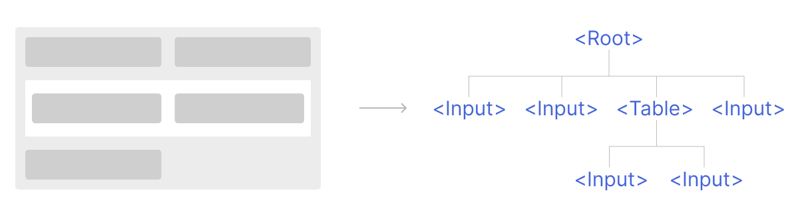
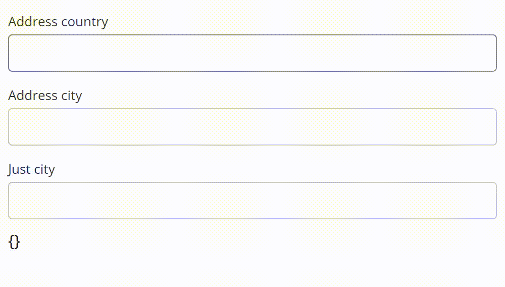
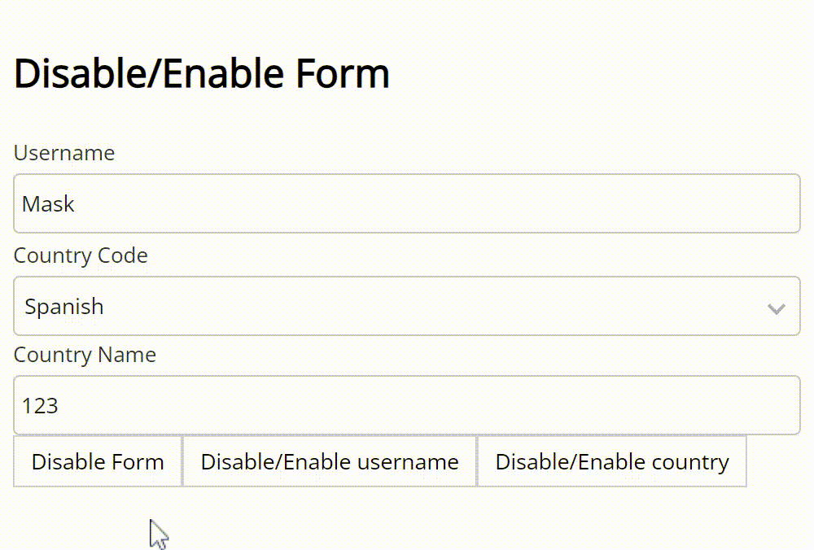

# Удобные формы для Vue

Механизм реактивности `VueJS` и нововведение в направлении
`provide/inject` позволяют разработчикам экспериментировать и
реализовывать новые интересные решения. В этой статье я расскажу о
жизненном цикле разработки системы для работы с формами, которую я
запихнул в отдельную библиотеку.

## Предыстория

Больше года назад (с момента публикации статьи) я столкнулся с задачей
по реализации формы. Я не уделил внимание этой задаче и подумал, что
пару часов мне будет достаточно. Так и случилось: за час я склепал
форму, повесил `v-model` и был доволен собой.

Время шло, количество форм повышалось вместе с их функционалом. Я и
не успел моргнуть, как с обычной формой с пятью полями, я пришёл к
гигантам, которые содержали сотню полей ввода, десяток таблиц. Также
всё усугубляло то, что все эти формы являлись динамическими: в одних
условиях необходимо было показать все поля, в других часть 
заблокировать, а часть скрыть (десяток таблиц конечно я преувеличил,
3 таблицы и 53 поля ввода для формы выделения частоты был моим рекордом).

Вот тут я осознал величину проблему. Ведь что может быть хуже,
чем сто `v-model`. Именно в этот самый момент я начал искать другое
решение. Я выделил следующие критерии для функционала:

- Механизм `subscribe` при котором дочерняя таблица(или любой дочерний
элемент) сможет подписаться на родительский элемент и обновиться в
момент обновления родителя. Достаточно простая, но полезная функция,
которая поддерживает целостность решения.
- Удобный и прозрачный механизм работы со значениями и изменениями.
Под изменениями я предполагаю механизм для отслеживания полей, которые
были изменены (круто когда кнопочка `save` загорается при изменении
значения и гаснет, когда мы возвращаем значение к исходному состоянию).
А также возможность сохранить изменения или откатить до первоначальных
значений. 
- Возможность блокировки части формы. Как одно из решений для текущего
пункта, можно назвать динамическое построение формы. Например,
анализируя некие `metadata`, мы можем принять решение о том, стоит ли
нам показывать данное поле. Если стоит, то есть ли необходимость его
блокировать. *Именно этот функционал я считаю теперь очень спорным. Т.к.
он связан с динамическим построением форм.* 

Выдвинув такие требования я начал шерстить интернет в поисках
элегантной библиотеки. А поскольку вы читаете данную статью - решение
не было найдено (Есть крутые библиотеки, но они работают с формой только
со стороны данных и не дают никакой связи между элементами).
Тогда и было решено написать что-нибудь своё, желательно не очередной
велосипед. 

Теперь пару часов в день после работы я сидел и писал код. За то время
я успел выпустить две версии и речь в этой статье пойдёт именно о
второй. Актуальная версия находится на
[GitHub](https://github.com/Jenesius/vue-form).

## Оптимизация

В момент, когда появлялись мысли о медленной работе (или о том, что
в будущем может медленно работать), я пользовался тремя правилами
оптимизации:

- Не оптимизируй.
- Не оптимизируй.
- Не оптимизируй.

Конечно это всё в шутку. А может и нет...

## Начало

Окей! Будем двигаться по выдвинутым выше требованиям и рассмотрим
реализацию каждого. Я постарался всё структурировать так, чтобы
читатель не видел надпись *"это будет позже"*.

Основной элемент (можно сказать единственный) это `Form`. На этом
этапе он из себя представляет пустой `class`. По мере рассказа я буду
расширять его.

### Subscribe

Подписка и отписка являются простыми в реализации. В класс `Form` 
добавим два свойства:

#### dependencies

- Type: `T[]`, где `T`: `T extends { name: string }`. 

Представляет собой набор дочерних элементов, которые мы подписываем на
форму. Обратите внимание, что дочерний элемент должен в себе содержать
поле `name`. В первой реализации такого условия не было, что приводило
к вопросу: кто это у нас тут подписан. Также в момент добавления
дочернего элемента, в его поле `parent` устанавливается ссылка на
родителя. При удалении убирается.

*Реализация через список - оптимальнее.*


#### parent

- Type: `Form | null`

Та самая ссылка на родителя.

Также добавим два метода `subscrive/unsubscribe`, которые принимают
элемент и используются для подписки/отписки от формы.

##### Базовая форма
Базовой формой, я буду называть ту, где поле `parent` равно `null`.

Чем-то это всё напоминает модель `DOM`.

Также воспользуемся `provide/inject`, которые предоставляются `vue`
(версия 3). Здесь тоже всё просто, если есть родитель - подписываемся
на него. Также предоставляем(`provide`) форму для дочерних элементов:

```ts
// Получаем родителя
const parent = inject(Form.PROVIDE_NAME);
if (parent) parent.subscribe(parent);

// Передаём себя как родителя
provide(Form.PROVIDE_NAME, this)
```

`Form.PROVIDE_NAME` это строковая константа. Это немного не полный
пример. Я убрал из него дополнительные проверки, чтобы сделать пример
более кратким. Но надеюсь суть вы уловили.

В графическом эквиваленте это выглядит как-то так:


С подпиской мы закончили. На что ещё нужно обратить внимание - в
зависимости мы можем положить любую сущность: таблица, блок с 
коммуникацией, другую форму. Главное установить поле `name`. Двигаемся
дальше.

___

Теперь осталось описать связь родительского и дочернего элемента. Я
взял за основу одно правило: дочерний элемент не проводит никаких
манипуляций с данными, а просто передаёт их наверх родителю. Все
преобразования, изменение состояний выполняет
[базовая форма](#базовая-форма) и создаёт событие, которое передаёт в 
дочерние элементы. Те реагируют на него, уведомляют подписанные на них
дочерние элементы и так далее по цепочке.

## Работа со значениями

Казалось бы нет никакой проблемы установить значение в форму и
уведомить об этом дочерний элемент. Да! Именно так было в первой
версии этого проекта. Получили значение из поля - уведомили тех, кто 
подписан на `name` из этого поля. Тут отлично вписывался `Vue` со
своей реактивностью.

Время шло, на проект был добавлен `GraphQL`. Да и логика полей
усложнилась: появились составные поля. Под составными я понимаю те, 
которые состоят из нескольких других: `Address` (страна, город, улица,
дом), `Passport` (номер, дата окончания действия). 
В таком случае нам удобно хранить значения полностью в разобранном
состоянии:

```json
{
  "name": "Jack",
  "address": {
    "country": "German",
    "city": "Berlin",
    "street": "Unter den Linden"
  },
  "passport": null
}
```

И вот мы пришли к **первому** правилу обработки: все значения
переданные в форму, должны раскладываться на простые составляющие, а
переданные названия разбиваться на составные (Я разбиваю названия по 
`.`).

В случае, если мы захотим установить следующее значение в форму:

```json
{
  "address.country": "Denmark",
  "address": {
    "city": "Copenhagen"
  }
}
```
То оно будет с конвертировано в:
```json
{
  "address": {
    "country": "Denmark",
    "city": "Copenhagen"
  }
}
```

Такой подход нам позволяет использовать поля любой сложности и 
значения любого вида и формы, т.к. они в конечном случае будут все
упрощены.

##### Не итерируемое значение

Под простыми значениями, которые не будут раскладываться, в проекте
они называются не итерируемыми, я подразумеваю следующие:
- Примитив.
- Массив.
- Замороженный объект (`Object.isFrozen`).
- Функция.

Можно задаться вопросом, почему доходя до массива мы прерываем процесс
упрощения (развёртывания). Ответ очень прост - на это попросту не было
времени и мы не видели целесообразность. Разумеется в будущем массив
будет убран из числа *простых*.

Чтобы стало ещё понятнее, для чего используется такой подход, я
приведу пример кода из своего рабочего проекта:

Компонента `address` выглядит следующим образом (`<form-field/>` единый
механизм подключения разных полей для ввода. В зависимости от значения
параметра `type` будет подставляться соответсвующее поле. Сам `address`
состоит из двух текстовых полей):
```html
<div>
    <form-field name = "country"/>
    <form-field name = "city" />
</div>
```

Подключим её в `App.vue`:

```html
<div>
    <!--Подключаем address -->
    <form-field type = "address" name = "mainAddress"/>
    
    <form-field name = "mainAddress.city"/>
</div>
```

У нас отображается три поля. Поле `city` внутри `address` будет
связано с полем `officeAddress.city`. Иными словами они будут
полагаться на одно и то же значение в форме. Выглядит это следующим
образом:



Таким образом мы добавили наш первый метод в `Form`:
```js
function setValues(values) {
    if (this.parent)
        return void this.parent.setValues({
            [this.name]: values
        })
    
    // Танец с бубном [2]
}
```

Как видно из кода, мы не выполняем никаких преобразований на дочернем
элементе - пусть всем занимается родитель, а мы подождём результат. 
В таком случае, если у нас есть базовая форма и форма `address`, то
в случае `setValues({ city: "Berlin" })` вызванный из `address`, до
базовой формы дойдёт уже объект:
```json
{
  "address": {
    "city": "Berlin"
  }
}
```

Возвращаемся к `Танец с бубном [2]`. Тут алгоритм работы следующий:

- Разложение (упрощение) переданных значений.
- Поиск изменений.
- Проецирование изменений.

С разложением всё очень просто, полностью алгоритм здесь описывать я 
не буду, но приблизительный принцип в нём следующий: 
1. идём по свойствам объекта
2. если свойство является составным (присутствует `.`), то
   (prefix - первая часть свойства, restName - остальная часть свойства,
restValue - значение свойства) добавляем свойство `prefix` со значением
`{ [restName]: restValue }`
3. Если значение является итерируемым
(не [простое значение](#не-итерируемое-значение)), запускаем этот же
алгоритм для этого значений.

Теперь у нас есть разложенное значение (кстати в проекте такое понятие
заменено на `grand object`), переходим к сравнению изменений.

И вот у нас есть значения формы и изменения, которые нужно добавить.
Сразу задаёмся вопросом: как хранить значения и изменения. Тут было
найдено следующее решение:
- Значения формы (чистые значения) хранятся в `pureValues`.
- Изменения хранятся в `changes`.
- А результирующие значения (проекция `changes` на `pureValues`) 
хранятся в `values`.

Такой подход позволит нам легко получить изменения и первоначальное
значение. Также в метод `setValues` были добавлен второй параметр:
`options` со свойством `changed`. Это нужно для того, чтобы отделить
процесс изменения формы, от процесса установки значений(в объект 
`pureValues`). 

Также рассматривался подход с хранением цепочек изменений, однако
преимуществ такого подхода я не нашёл.

Теперь переходим к сравнению изменений. У нас есть текущие изменения 
и есть текущий объект значений. Т.к. все привыкли к функции `watch` в
`VueJS`, то было бы неплохо сделать также! И вот тут имеется
загвоздка. Теперь нам нужно сделать копию старого объекта, чтобы не
потерять предыдущие значения (а всё это нужно для того, чтобы мы
имели доступ не только к newValue, но и к oldValue). Ну, раз такая
песня - обратимся к правилу [оптимизации](#оптимизация) и двинемся 
дальше. Копирование объект кстати очень похоже на `grand object`:
мы проходим по свойствам объекта, если находим итерируемом - запускаем
процесс копирования от него и т.д.

Я приведу пример того, как выглядит результат сравнения:

- values формы:
```json
{
   "login": "Jack"
} 
```

- сами изменения

```json
{
   "login": "Jonny",
   "address": {
      "city": "Berlin"
   }
}
```

- результат сравнения

```ts
[
   { name: "login", newValue: "Jonny", oldValue: "jack" },
   { name: "address", newValue: { city: "Berlin" }, oldValue: undefined },
   { name: "address.city", newValue: "Berlin", oldValue: undefined }     
] 
```

Как видно в результате у нас участвуют все поля. Это нужно для того,
чтобы форма точно знала, какие изменения в неё произошли. 

Теперь мы проходим по всем элементам этого массива и генерируем
событие изменения, передовая туда `newValue` и `oldValue`. Затем идём
по дочерним элементам и передаём им урезанное событие: только те поля,
которые относятся к этому дочернему элементу (по полю `name`).

Готово! Это действительно полностью рабочий механизм реактивной формы.
Теперь подключаем это всё к реактивности `VueJS`, добавляем `ref`,
которые изменяем, когда форма уведомляет об изменении конкретного 
поля. Но... нам этого мало.

А что, если мы захотим установить изменения формы, полностью
перезаписав значения формы. А что, если мы хотим установить полностью
новые изменения для конкретного поля, а не смешивать их. А что, если
мы захотим для дочернего элемента сделать вышесказанные пункты. Тут
конечно немного голова опухла. Слишком много переменных...

Но оказалось всё не так критично. В функции `setValues` расширяем
параметры, добавив:

- target. Какое поле будем изменять. Для примера приведу следующее:
```ts
form.setValues({ code: "P103" }, { target: "address.city" })
// { address: { city: { code: "P103" } } }
```
- clean. Если установлено `true`, то значение будет полностью
перезаписываться. Для примера приведу следующее:

Если values `{ address: { city: "Berlin" } }`, то при выключенному
параметре:
```ts
form.setValues({ address: { index: 10 } })
// { address: { city: "Berlin", index: 10 } }
```

При включенном параметре:
```ts
form.setValues({ address: { planet: "Mars" } }, { clean: true })
// { address: { planet: "Mars" } }
```

Всего лишь два параметра. Наша функция претерпела небольшие изменения:

- Если задан `target`, то мы сравниваем не весь объект значений формы,
а только ту часть, которая относится к `target`. 
- Если задан `clean`, то мы не примешиваем значения, а просто
сравниваем прошлый `values` с переданными новыми значениями.

Также не осталось без внимания откат изменений. Он нужен, чтобы
попросту отменить изменения и принять(как ни странно) изменения. 
Про "*принять изменения*" немного не понятно, вот пример:
```ts
form.setValues({ name: "Mask" }, { change: true })
form.setValues({ name: "Mask" })
```
В результате сравнения у нас будет пусто, ведь было `"Mask"` и стало
`"Mask""`. Вот тут и нужно подтверждение изменений. Оно выполняется
если текущее значение changes для поля идентично тому, которое
устанавливаем.

С установкой значений закончили. Такие функции, как откат изменений,
отказ значений, откат/принятие изменения для конкретного поля - это
всё вариации метода `setValues` и его параметров.

## Доступность полей

Перейдя к этому функционалу, я думал, что будет столько же мороки, 
сколько и с установкой значений. Были реализованы методы
`disable` и `enable`, в которые передаётся название поля, после чего
выполняется следующий алгоритм:
- Если было передано поле `XXX`, то все правила для полей `XXX.YYYYY`
аннулируются.
- Дальше мы проходим по всем дочерним элементам, у которых `XXX` это
префикс, и генерируем у них событие изменения доступности.
- Также проходим по подписанным событиям и делаем такую же проверку
на принадлежность события к полю.



На этом всё.

## Итог

Относительно простая реализация позволяет крутить форму, как мы захотим.
Данный проект полностью справляется со всеми потребностями в моих
проектах. Возможно и для вас он будет полезен.

Ссылка на [GitHub репозиторий](https://github.com/Jenesius/vue-form)

